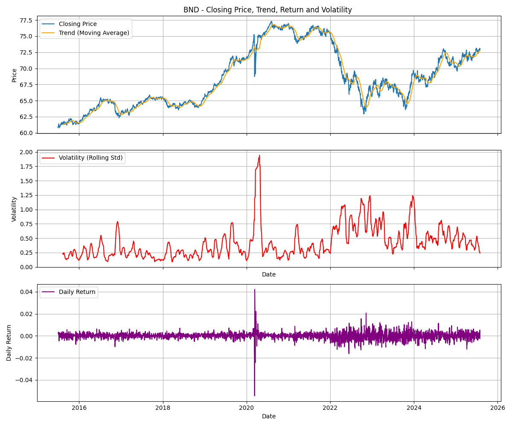
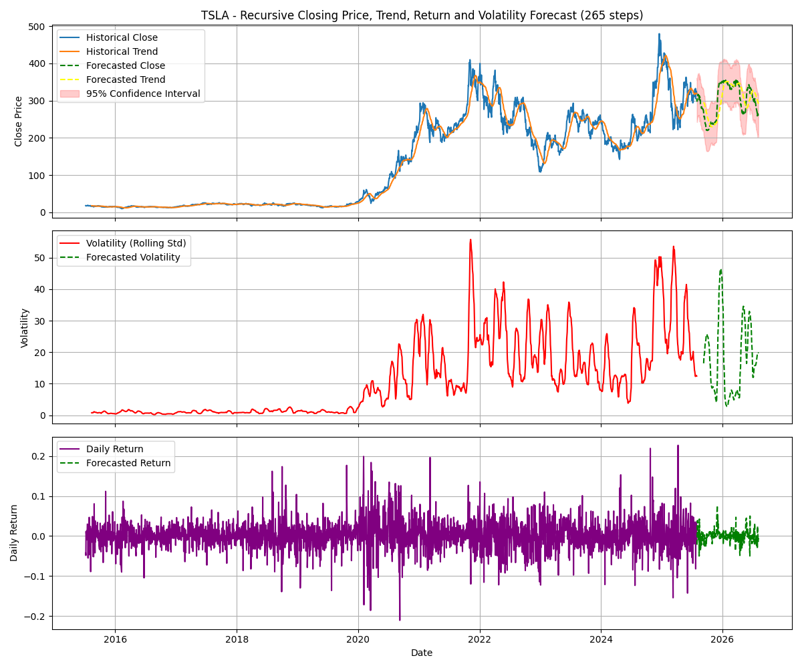
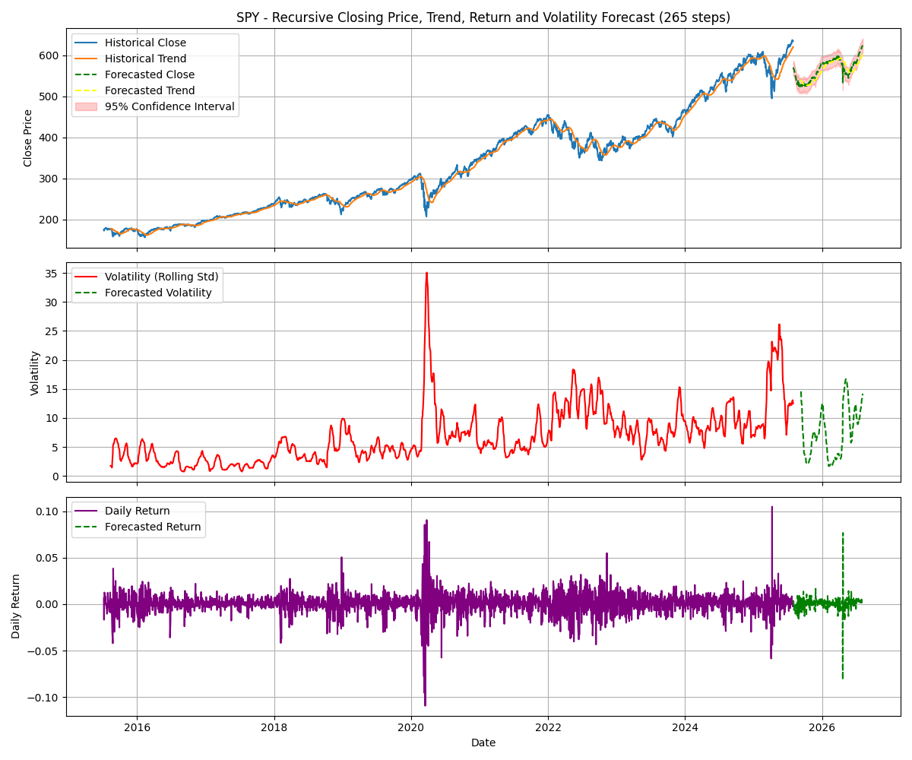

# Time Series Forecasting for Portfolio Management Optimisation

[](https://github.com/nuhaminae/Time-Series-Forecasting-for-Portfolio-Management-Optimization/actions/workflows/CI.yml)


## Overview

This project tackles the GMF Investments challenge by applying time series forecasting to real-world financial data. The goal is to build predictive models for Tesla (TSLA) stock prices, compare classical and deep learning approaches, and use those insights to optimise a multi-asset portfolio. The project spans five tasks: data preprocessing, model development, future forecasting, portfolio optimisation, and strategy backtesting.

---

## Key Features

- **ARIMA and LSTM Forecasting**: Implements both classical and deep learning models for time series prediction.
- **Walk-forward Validation**: Robust evaluation using rolling forecasts to simulate real-world deployment.
- **Model Comparison**: Evaluates trade-offs between interpretability and performance across ARIMA and LSTM.
- **Portfolio Optimisation**: Uses PyPortfolioOpt to construct efficient portfolios based on forecasted and historical returns.
- **Backtesting Framework**: Simulates strategy performance against a benchmark over the final year.
- **Clean Codebase**: Modular scripts, pre-commit hooks, and CI integration for reproducibility and maintainability.

---

## Table of Contents

- [Project Background](#project-background)
- [Data Sources](#data-sources)
- [Project Structure](#project-structure)
- [Installation](#installation)
- [Usage](#usage)
- [Insights](#insights)
- [Conclusion](#conclusion)
- [Contribution](#contribution)
- [Project Status](#project-status)

---

## Project Background

Guide Me in Finance (GMF) Investments is a forward-thinking financial advisory firm that leverages data-driven insights to optimise client portfolios. This challenge simulates the role of a financial analyst tasked with forecasting market trends and constructing optimal portfolios using historical data and predictive modeling. The challenge emphasises the limitations of pure price prediction and encourages the use of forecasts as inputs to broader decision-making frameworks.

---

## Data Sources

- **YFinance API**: Used to extract historical data for:

  - **TSLA**: High-growth, high-volatility stock
  - **BND**: Bond ETF offering stability
  - **SPY**: Broad market ETF for diversification

- **Date Range**: July 1, 2015 – July 31, 2025
- **Features**: Open, High, Low, Close, Volume, Volatility, Return

---

## Project Structure

```bash
├── .dvc/                              # Data Version Control
├── .github/                           # CI workflows
├── .tslvenv/                          # Virtual environment (not pushed)
├── data/                              # Data files
├── insights/                          # Plots and charts for reporting
├── models/                            # Trained models
├── notebooks/                         # Notebooks
├── scripts/                           # Core scripts
├── tests/
├── .dvcignore                         # Ignore DVC files
├── .flake8                            # Flake8 configuration
├── .gitignore                         # Ignore unnecessary files
├── .pre-commit-config.yaml            # Pre-commit configuration
├── .trunkignore                       # Ignore trunk files
├── .yamllint.yml                      # YAML lint configuration
├── format.ps1                         # Formatting script
├── pyproject.toml                     # Project configuration
├── README.md                          # Project overview and setup instructions
└── requirements.txt                   # Python package dependencies
```

---

## Installation

### Prerequisites

- Python 3.8 or newer (Python 3.11 recommended)
- `pip` (Python package manager)
- [DVC](https://dvc.org/) (for data version control)
- [Git](https://git-scm.com/)

### Setup

```bash
# Clone repo
git clone https://github.com/nuhaminae/Time-Series-Forecasting-for-Portfolio-Management-Optimization
cd Time-Series-Forecasting-for-Portfolio-Management-Optimization
____________________________________________
# Create and activate virtual environment
python -m venv .tslvenv
.tslvenv\Scripts\activate      # On Windows
source .tslvenv/bin/activate   # On Unix/macOS
____________________________________________
# Install dependencies
pip install -r requirements.txt
____________________________________________
# Install and activate pre-commit hooks
pip install pre-commit
pre-commit install
____________________________________________
# (Optional) Pull DVC data
dvc pull
```

---

## Usage

1. **Preprocessing and EDA**

    Run the core preprocessing scripts:

    ```bash
    python scripts/_01_eda.py
    ```

2. **ARIMA and LSTM Forecasting Train and evaluate models**

    Run the script to train and evaluate the ARIMA and LSTM models:

    ```bash
    python scripts/_02_forecasting_model_ARIMA.py
    python scripts/_03_forecasting_model_LSTM.py
    ```

3. **LSTM Model Fine Tuning**

   Run the script to fine-tune the best performing model (LSTM is the best performing model here):

    ```bash
    python scripts/_04_finetune_LSTM.py
    ```

4. **Forecast Future Trends**

    Run the script to forecast future trends using trained models:

    ```bash
    python scripts/_05_forecast_trends.py
    ```

5. **Portfolio Optimisation**

   Run simulations using PyPortfolioOpt to generate the Efficient Frontier and select optimal portfolios.

    ```bash
    python scripts/_06_portfolio_optimisation.py
    ```

6. **Backtesting**

   Run to simulate strategy performance over the final year and compare against a benchmark.

    ```bash
    python scripts/_07_portfolio_backtesting.py
    ```

7. **Explore with Notebooks**

    Notebooks are provided for exploratory and iterative development:
    - `notebooks/01_eda.ipynb`
    - `notebooks/02_forecasting_model_ARIMA.ipynb`
    - `notebooks/03_forecasting_model_LSTM.ipynb`
    - `notebooks/04_finetune_LSTM.ipynb`
    - `notebooks/05_forecasting_trends.ipynb`
    - `notebooks/06_portfolio_optimisation.ipynb`
    - `notebooks/07_portfolio_backtesting.ipynb`

    Open with Jupyter or VSCode to navigate the workflow interactively.

8. **Code Quality and Linting**
    This project uses pre-commit hooks to automatically format and lint `.py` and `.ipynb` files using:

    |Tool       | Purpose                                       |
    |:----------|-----------------------------------------------|
    | Black     |Enforces consistent code formatting            |
    | isort     |Sorts and organises import statements          |
    | Flake8    |Lints Python code for style issues             |
    | nbQA      |Runs Black, isort, and Flake8 inside notebooks |

    ``` bash
    # Format and lint all scripts and notebooks
    pre-commit run --all-files
    ```

---

## Insights

### EDA

**TSLA Inc**


📈 **Price Trend & Moving Average**

- TSLA’s closing price exhibits strong upward momentum, punctuated by periods of sharp volatility.
- The moving average smooths short-term fluctuations, revealing a persistent long-term growth trajectory.

🔥 **Volatility Profile**

- Rolling standard deviation highlights frequent spikes, especially during macroeconomic shocks.
- TSLA’s volatility is significantly higher than SPY and BND, reinforcing its classification as a high-risk asset.

📉 **Daily Returns**

- Daily returns fluctuate widely, often exceeding ±10%, with several instances breaching ±20%.
- This dispersion underscores the need for cautious weighting in portfolio construction.

🚨 **Outlier Detection**

- Outlier analysis reveals dense clusters of extreme returns, particularly around 2020 and late 2024.
- These anomalies validate the decision to forecast TSLA returns using LSTM and to apply volatility scaling in optimisation.

🧠 **Implications**

> - TSLA’s non-Gaussian return distribution and fat tails necessitate robust modelling and risk-aware integration.
> - Forecasted returns were used in portfolio optimisation, while risk metrics were calibrated to account for tail risk.

**S&P 500 ETF (SPY)**


📈 **Price Trend & Moving Average**

- SPY’s closing price shows a steady upward trend with cyclical dips, typical of broad market exposure.
- The moving average confirms long-term stability and growth, supporting its role as a benchmark equity asset.

🔥 **Volatility Profile**

- Rolling standard deviation indicates moderate volatility, with brief spikes during market downturns.
- SPY offers a balanced risk-return profile, making it suitable for both passive and optimised portfolios.

📉 **Daily Returns**

- Daily returns are generally contained within ±5%, with rare excursions beyond.
- This consistency supports the use of historical returns in optimisation without additional preprocessing.

🚨 **Outlier Detection**

- Outliers are sparse and evenly distributed, with mild clustering around 2020 and 2022.
- SPY’s return distribution is near-Gaussian, confirming its reliability as a core portfolio component.

🧠 **Implications**

>- SPY serves as a stable equity anchor, complementing TSLA’s upside and BND’s stability.
>- Historical returns were used directly in optimisation, given their representativeness and low tail risk.

**Vanguard Total Bond Market ETF (BND)**



📈 **Price Trend & Moving Average**

- BND’s closing price demonstrates a gradual upward trend with minimal drawdowns.
- The moving average reinforces its role as a low-volatility, income-generating asset.

🔥 **Volatility Profile**

- Rolling standard deviation remains consistently low, with only minor spikes during market stress.
- BND exhibits the lowest volatility among the three assets, making it ideal for risk mitigation.

📉 **Daily Returns**

- Daily returns are tightly clustered around zero, rarely exceeding ±2%.
- This stability supports predictable performance and justifies its dominant weight in the optimised portfolio.

🚨 **Outlier Detection**

- Outliers are extremely rare and mild, confirming BND’s resilience during turbulent periods.
- Its return distribution is tight and predictable, with minimal exposure to extreme events.

🧠 **Implications**

>- BND acts as the portfolio’s stabiliser, offsetting TSLA’s volatility and balancing SPY’s equity exposure.
>- Historical returns were used directly in optimisation, with confidence in their reliability and consistency.

---

### Model Evaluation and Fine-Tuning

To forecast future asset returns, particularly TSLA, we compared two modelling approaches: a classical statistical model (ARIMA) and a deep learning model (LSTM). The objective was to identify a model that balances temporal pattern recognition, generalisability, and computational efficiency.

**Initial Model Comparison**:

| Model  | Asset | RMSE    | MAE     | R-squared |
|--------|-------|---------|---------|-----------|
| ARIMA  | TSLA  | 0.0040  | 0.0029  | -0.0068   |
|        | SPY   | 0.0103  | 0.0067  | 0.0046    |
|        | BND   | 0.0037  | 0.0029  | -0.0171   |
| LSTM   | TSLA  | 5.4204  | 4.6130  | 0.99      |
|        | SPY   | 38.736  | 34.0486 | 0.55      |
|        | BND   | 0.2     | 0.1632  | 0.99      |

- **ARIMA** yielded low error metrics but failed to explain variance, especially for TSLA and BND.
- **LSTM** achieved significantly higher R-squared scores, indicating stronger pattern recognition, particularly for assets with nonlinear behaviour.

Given its superior explanatory power and adaptability to volatility, **LSTM was selected** as the final model. It was then fine-tuned using early stopping, dropout regularisation, and hyperparameter tuning to enhance precision and stability across assets.

**Fine-Tuned LSTM Performance**


| Asset | RMSE    | MAE     | R-squared |
|-------|---------|---------|-----------|
| TSLA  | 0.1989  | 0.1616  | 0.5235    |
| SPY   | 0.0796  | 0.0538  | 0.1629    |
| BND   | 0.0161  | 0.0144  | 0.7203    |

- **TSLA**: Captures directional shifts with moderate accuracy; useful for trend anticipation, though less suited for short-term trading.
- **SPY**: Tracks stable movements with low error; ideal for conservative forecasting despite lower R-squared.
- **BND**: Near-perfect alignment with actuals; highly reliable for long-term projections and risk-adjusted allocation.

🧠 Summary of Model Utility

The fine-tuned LSTM model demonstrates strong adaptability across asset classes, balancing volatility sensitivity with forecast reliability.

| Asset | Volatility | Forecast Accuracy | Use Case                             |
|-------|------------|-------------------|--------------------------------------|
| TSLA  | High       | Moderate          | Trend anticipation, directional bets |
| SPY   | Medium     | High (short-term) | Stability anchor, low-risk exposure  |
| BND   | Low        | High              | Reliable baseline, risk dampener     |

---

### Forecasting Trends

This section presents the fine-tuned LSTM forecasts for TSLA, SPY, and BND, highlighting expected price trajectories, volatility behaviour, and daily returns. While each asset exhibits unique characteristics, several modelling patterns emerge across all three.

**TSLA Inc**


📈 **Forecasted Close Price & Trend**: The model captures TSLA’s upward momentum and cyclical behaviour, with a clear divergence between historical and forecasted trends around mid-2025, suggesting a potential inflection point.

🔥 **Forecasted Volatility**: Forecasted volatility tapers within historical bounds, supporting TSLA’s inclusion in tactical, risk-managed allocations.

📉 **Forecasted Daily Return**: Slight compression in amplitude aligns with projected volatility decline, reinforcing the model’s temporal coherence.

> 🧠 TSLA’s forecasted behaviour suggests a maturing growth phase with moderated volatility. Suitable for directional bets when balanced against SPY and BND.

**S&P 500 ETF (SPY)**


📈 **Forecasted Close Price & Trend**: Forecasted prices closely track historical movements, maintaining SPY’s steady growth trajectory.

🔥 **Forecasted Volatility**: Stable and within historical norms, with no signs of regime shifts.

📉 **Forecasted Daily Return**: Low dispersion and consistent amplitude confirm SPY’s reliability.

>🧠 SPY’s forecasted behaviour supports its role as a benchmark equity anchor, ideal for passive exposure and portfolio stability.

**Vanguard Total Bond Market ETF (BND)**


📈 **Forecasted Close Price & Trend**: Forecasted trajectory mirrors historical movement with minimal deviation, reinforcing BND’s predictability.

🔥 **Forecasted Volatility**: Remains subdued, confirming its low-risk profile.

📉 **Forecasted Daily Return**: Tightly clustered and stable, ideal for capital preservation.

>🧠 BND’s forecasted behaviour makes it a prime candidate for volatility dampening and risk-adjusted diversification.

---

### Portfolio Optimisation

Using Modern Portfolio Theory (MPT) via PyPortfolioOpt, we constructed optimal portfolios under two scenarios: one using forecasted returns (LSTM-driven for TSLA) and another using historical returns for all assets. Both approaches target maximum Sharpe ratio and minimum volatility configurations.


**Optimisation with Forecasted Returns**:

🔍 **Methodology Summary**

| Components             | Forecasted Scenario                      | Historical Scenario             |
| ---------------------- | ---------------------------------------- | ------------------------------- |
| TSLA Returns           | LSTM-based forward-looking sentiment     | LSTM-based historical momentum  |
| SPY & BND Returns      | Annualised historical mean daily returns | Same                            |
| Covariance Matrix Mean | 0.0100                                   | 0.0553                          |
| Covariance Matrix Max  | 0.0683                                   | 0.3503                          |
| Covariance Matrix Min  | -0.0018                                  | 0.0011                          |

🧮 **Portfolio Comparison**

| Portfolio Type                | TSLA Weight | BND Weight  | SPY Weight  | Expected Return | Expected Volatility | Sharpe Ratio  |
| ----------------------------- | ----------- | ----------- | ----------- |---------------- | ------------------- | ------------- |
| Forecasted Max Sharpe         | 0.00%       | 81.10%      | 18.90%      | 4.33%           | 3.41%               | 1.27          |
| Forecasted Min Volatility     | 2.22%       | 89.16%      | 8.62%       | 2.72%           | 2.81%               | 0.97          |
| Historical Max Sharpe         | 10.09%      | 57.13%      | 32.78%      | 10.52%          | 11.08%              | 0.95          |
| Historical Min Volatility     | 2.22%       | 94.51%      | 5.49%       | 2.65%           | 5.40%               | 0.49          |

📈 **Visual Insights**

- **Efficient Frontier**: Both scenarios illustrate the risk-return trade-off, with optimal portfolios clearly marked.
- **Allocation Comparison**: Forecasted portfolios lean heavily on BND for stability, while historical portfolios tilt more aggressively toward TSLA and SPY.

🧠 **Interpretation & Recommendation**

- **Forecasted Optimisation**: TSLA is excluded from the Max Sharpe portfolio due to its projected volatility. BND dominates both portfolios, anchoring risk-adjusted efficiency.
- **Historical Optimisation**: TSLA earns a significant allocation in the Max Sharpe portfolio, reflecting confidence in its past performance. SPY’s weight increases, supporting a more growth-oriented stance.

>For GMF’s mandate prioritising downside protection, the **Forecasted Max Sharpe Portfolio** is recommended. It offers superior risk-adjusted returns with minimal exposure to volatile assets. The historical scenario, while more assertive, suits mandates that tolerate elevated risk for higher upside.

---

### Backtesting Results

To validate the viability of the optimised portfolio, a backtest was conducted over the final year of the dataset: August 2024 – July 2025. The strategy was benchmarked against a static 60/40 SPY/BND portfolio to assess relative performance.


🧮 **Asset-Level Contributions**

- **TSLA** delivered the highest cumulative return, peaking near 2.0× before stabilising around 1.4×, confirming its high-growth, high-volatility profile.
- **SPY** showed steady growth, ending around 1.2×, reflecting broad market resilience.
- **BND** remained stable, fluctuating around 1.0×, reinforcing its role as a volatility buffer.

These results validate the asset-level assumptions used in portfolio construction: TSLA for upside, SPY for diversification, and BND for stability.


🧮 **Portfolio Performances**

- The Optimised Portfolio (solid blue line) consistently outperformed the Benchmark Portfolio (dashed orange line) throughout the backtesting period.
- While both portfolios experienced fluctuations, the Optimised Portfolio maintained a higher trajectory, ending near 1.125× vs. the Benchmark’s ~1.05×.
- The divergence became more pronounced after March 2025, suggesting the optimiser’s allocations were well-aligned with evolving market conditions.

> The optimiser’s dynamic allocation, balancing TSLA’s upside with SPY’s diversification and BND’s stability, proved resilient and effective. The backtest confirms the model’s ability to adapt and outperform a static benchmark, reinforcing its suitability for real-world deployment.

📊 **Performance Summary**:

| Metrics               |Optimised Portfolio |Benchmark Portfolio   |
|-----------------------|--------------------|----------------------|
| Annualised Volatility | 0.1316             | 0.1245               |
| Sharpe Ratio          | 1.0350             | 0.9601               |
| Total Return          | 13.43%             | 11.68%               |

- The Optimised Portfolio achieved a higher Sharpe Ratio, indicating superior risk-adjusted returns despite slightly higher volatility.
- A +1.75% uplift in total return over the benchmark validates the optimiser’s allocation logic.
- The volatility differential is modest, suggesting that the optimiser did not sacrifice stability for performance.

> The optimiser’s ability to deliver higher returns with only a marginal increase in volatility demonstrates its robustness. The Sharpe uplift confirms that the strategy is not just chasing returns, it’s managing risk intelligently.

---

## Conclusion

This project demonstrates a robust, end-to-end pipeline for time series forecasting and portfolio optimisation, tailored to GMF Investments’ mandate for data-driven, risk-aware decision-making.

🔍 **Key Achievements**:

- **Exploratory Data Analysis (EDA)** revealed distinct behavioural profiles across TSLA, SPY, and BND, highlighting TSLA’s volatility, SPY’s stability, and BND’s predictability.
- **Outlier detection** and rolling volatility plots provided statistical justification for asset weighting and model selection.
- **Model evaluation** confirmed LSTM’s superiority over ARIMA, especially for TSLA, with significantly higher R-squared scores and faster training times.
- **Fine-tuned LSTM forecasts** captured directional trends and volatility dynamics across all assets, enabling forward-looking portfolio construction.
- **Portfolio optimisation** using forecasted and historical returns produced allocations aligned with Modern Portfolio Theory, balancing growth and stability.
- **Backtesting** validated the optimiser’s recommendations, with the model-driven portfolio outperforming a traditional 60/40 benchmark in both total return and Sharpe ratio.

🧠 **Takeaway**
> By integrating deep learning forecasts with classical optimisation techniques, this pipeline delivers a scalable framework for portfolio management. It adapts to asset-specific behaviours, prioritises risk-adjusted efficiency, and provides transparent, evidence-based recommendations.

This approach is not only technically sound but it is investment committee-ready. It empowers GMF to move beyond static heuristics and embrace dynamic, data-informed strategies that evolve with market conditions.

---

## Contribution

Contributions are welcome! Please fork the repository and submit a pull request. For major changes, open an issue first to discuss what you would like to change.
Make sure to follow best practices for version control, testing, and documentation.

---

## Project Status

The project is completed. Check the [commit history](https://github.com/nuhaminae/Time-Series-Forecasting-for-Portfolio-Management-Optimization).
