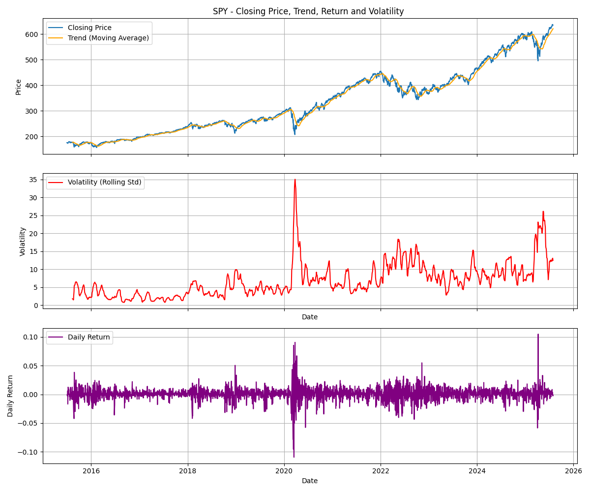
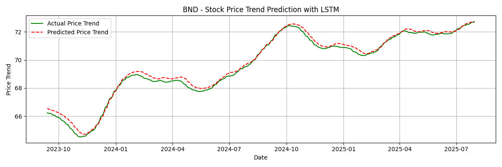

# Time Series Forecasting for Portfolio Management Optimization

[](https://github.com/nuhaminae/Time-Series-Forecasting-for-Portfolio-Management-Optimization/actions/workflows/CI.yml)


## Overview

This project tackles the GMF Investments challenge by applying time series forecasting to real-world financial data. The goal is to build predictive models for Tesla (TSLA) stock prices, compare classical and deep learning approaches, and use those insights to optimise a multi-asset portfolio. The project spans five tasks: data preprocessing, model development, future forecasting, portfolio optimisation, and strategy backtesting.

---

## Key Features

- ARIMA and LSTM Forecasting: Implements both classical and deep learning models for time series prediction.
- Walk-forward Validation: Robust evaluation using rolling forecasts to simulate real-world deployment.
- Model Comparison: Evaluates trade-offs between interpretability and performance across ARIMA and LSTM.
- Portfolio Optimisation: Uses PyPortfolioOpt to construct efficient portfolios based on forecasted and historical returns.
- Backtesting Framework: Simulates strategy performance against a benchmark over the final year.
- Clean Codebase: Modular scripts, pre-commit hooks, and CI integration for reproducibility and maintainability.

---

## Table of Contents

- [Project Background](#project-background)
- [Data Sources](#data-sources)
- [Project Structure](#project-structure)
- [Installation](#installation)
- [Usage](#usage)
- [Insights](#insights)
- [Next Steps](#next-steps)
- [Contribution](#contribution)
- [Project Status](#project-status)

---

## Project Background

Guide Me in Finance (GMF) Investments is a forward-thinking financial advisory firm that leverages data-driven insights to optimise client portfolios. This challenge simulates the role of a financial analyst tasked with forecasting market trends and constructing optimal portfolios using historical data and predictive modeling. The challenge emphasises the limitations of pure price prediction and encourages the use of forecasts as inputs to broader decision-making frameworks.

---

## Data Sources

- **YFinance API**: Used to extract historical data for:

  - **TSLA**: High-growth, high-volatility stock
  - **BND**: Bond ETF offering stability
  - **SPY**: Broad market ETF for diversification

- **Date Range**: July 1, 2015 – July 31, 2025
- **Features**: Open, High, Low, Close, Volume, Volatility, Return

---

## Project Structure

```bash
├── .dvc/                              # Data Version Control
├── .github/                           # CI workflows
├── data/
│   ├── raw/                           # Original datasets
│   └── processed/                     # Cleaned and transformed datasets
├── insights/                          # Plots and charts for reporting
├── models/                          
├── notebooks/                         # Notebooks
│   ├── 01_eda.ipynb
│   ├── 02_forecasting_mode_ARIMA.ipynb
|   ├── 03_forecasting_mode_LSTM.py
|   └── ...
├── scripts/                           # Core scripts
│   ├── __init__.py
|   ├── _01_eda.py
|   ├── _02_forecasting_model_ARIMA.py
|   ├── _03_forecasting_model_LSTM.py
|   └── ...
├── tests/
|   ├── test_dummy.py
|   └── ...
├── .dvcignore
├── .flake8
├── .gitignore                         # Ignore unnecessary files
├── .pre-commit-config.yaml            # Pre-commit configuration
├── ...
├── format.ps1                         # Formatting
├── pyproject.toml
├── README.md                          # Project overview and setup instructions
└── requirements.txt                   # Pip install fallback
```

---

## Installation

### Prerequisites

- Python 3.8 or newer (Python 3.11 recommended)
- `pip` (Python package manager)
- [DVC](https://dvc.org/) (for data version control)
- [Git](https://git-scm.com/)

### Setup

```bash
# Clone repo
git clone https://github.com/nuhaminae/Time-Series-Forecasting-for-Portfolio-Management-Optimization
cd Time-Series-Forecasting-for-Portfolio-Management-Optimization
____________________________________________
# Create and activate virtual environment
python -m venv .tslvenv
.tslvenv\Scripts\activate      # On Windows
source .tslvenv/bin/activate   # On Unix/macOS
____________________________________________
# Install dependencies
pip install -r requirements.txt
____________________________________________
# Install and activate pre-commit hooks
pip install pre-commit
pre-commit install
____________________________________________
# (Optional) Pull DVC data
dvc pull
```

---

## Usage

1. **Preprocessing and EDA**
    Run the core preprocessing scripts:

    ```bash
    python scripts/_01_eda.py
    ```

2. **ARIMA and LSTM Forecasting Train and evaluate models**

    ```bash
    python scripts/_02_forecasting_model_ARIMA.py
    python scripts/_03_forecasting_model_LSTM.py
    ```

3. **Forecast Future Trends** (Next Step)

   Use trained models to forecast 6–12 months ahead and visualize confidence intervals.

4. **Portfolio Optimization** (Next Step)

   Run simulations using PyPortfolioOpt to generate the Efficient Frontier and select optimal portfolios.

5. **Backtesting** (Next Step)

   Simulate strategy performance over the final year and compare against a benchmark.

6. **Explore with Notebooks**

    Notebooks are provided for exploratory and iterative development:
    - `notebooks/01_eda.ipynb`
    - `notebooks/02_forecasting_model_ARIMA.ipynb`
    - `notebooks/03_forecasting_model_LSTM.ipynb`
    Open with Jupyter or VSCode to navigate the workflow interactively.

7. **Code Quality and Linting**
    This project uses pre-commit hooks to automatically format and lint `.py` and `.ipynb` files using:

    |Tool       | Purpose                                       |
    |:----------|-----------------------------------------------|
    | Black     |Enforces consistent code formatting            |
    | isort     |Sorts and organises import statements          |
    | Flake8    |Lints Python code for style issues             |
    | nbQA      |Runs Black, isort, and Flake8 inside notebooks |

    ``` bash
    # Format and lint all scripts and notebooks
    pre-commit run --all-files
    ```

---

## Insights

### TimeSeries Insights: TSLA Closing Price & Trend


- **Long-Term Growth Surge (2020–2021):**
  - TSLA experienced a dramatic price increase starting in early 2020, peaking in late 2021.
  - This aligns with broader tech sector momentum and investor enthusiasm during the pandemic recovery phase.

- **Post-Peak Volatility (2022–2024):**
  - After the peak, the price shows sharp fluctuations, indicating increased market uncertainty or correction.
  - The trend line smooths out these movements, suggesting a decelerating growth trajectory.

- **Recent Stabilization and Recovery (2025–2026):**
  - While the price dipped post-2021, there's a modest recovery visible toward 2026.
  - The trend line suggests a potential bottoming out and reaccumulation phase.

- **Trend Overlay Utility:**
  - The orange trend line helps isolate the underlying direction, filtering out short-term noise.
  - Useful for identifying macro patterns and informing long-horizon forecasting models.

### Trend Analysis: SPY Closing Price



- **Strong Upward Trajectory:**
  - SPY’s closing price shows a consistent rise from 2016 to late 2021, peaking near $480.
  - Reflects the post-2016 bull market and pandemic recovery fueled by stimulus and tech growth.

- **2022–2023 Correction:**
  - A noticeable dip occurs during this period, likely tied to inflation concerns and interest rate hikes.
  - The trend line smooths this volatility, revealing a temporary deviation from long-term growth.

- **Recovery in 2024–2025:**
  - Prices rebound and resume upward momentum, suggesting renewed investor confidence or macro stabilization.

- **Modeling Implication:**
  - Trend overlays help identify regime shifts and support momentum-based strategies.
  - Useful for feature engineering in predictive models and for timing entry/exit points.

### Trend Analysis: BND Closing Price


- **Long-Term Stability:**
  - BND’s closing price fluctuates within a relatively narrow band (≈ $60–$77.5) over the decade.
  - This reflects the typical behavior of bond ETFs — lower volatility and more predictable returns compared to equities.

- **Trend Line Insights:**
  - The orange trend line smooths out short-term noise, revealing a gentle upward slope from 2015 to 2021, followed by a mild decline post-2022.
  - Suggests macroeconomic shifts (e.g. interest rate hikes) impacting bond valuations.

- **Modeling Implication:**
  - Trend overlays are useful for identifying regime changes and informing allocation strategies.
  - Can be used to generate momentum signals or as a feature in multi-asset portfolio models.

- **Strategic Takeaway:**
  - BND’s behavior supports its role as a stabilizing asset in diversified portfolios.
  - Trend-aware strategies may help optimize entry/exit timing for fixed-income exposure.

### ARIMA Forecasting: Log Return Prediction (TSLA)


- **Training vs. Forecast Window:**
  - The blue line represents training data used to fit the ARIMA model, ending around the 2000th time index.
  - The green line shows actual returns post-training, while the red dashed line displays ARIMA’s predicted returns.

- **Model Performance:**
  - The predicted return closely tracks the actual return, especially in the early forecast window.
  - Deviations increase slightly toward the end, suggesting diminishing accuracy over longer horizons.

- **Volatility Capture:**
  - ARIMA captures short-term fluctuations but may underreact to sharp spikes or regime shifts.
  - This is typical of linear models and highlights the need for volatility-aware enhancements (e.g. ARIMA-GARCH).

- **Modeling Implication:**
  - ARIMA is effective for baseline forecasting and benchmarking.
  - Consider hybrid models or ensemble approaches for improved tail risk and nonlinearity handling.

### LSTM Forecasting: Log Return Prediction (TSLA)


- **Actual vs. Predicted Behavior:**
  - The green line (actual return) shows high-frequency fluctuations and volatility across the time horizon.
  - The red dashed line (LSTM prediction) remains relatively flat near zero, indicating underfitting or overly conservative forecasting.

- **Model Limitations:**
  - The LSTM fails to capture the dynamic swings and tail events present in the actual return series.
  - This may be due to insufficient training epochs, lack of feature richness, or overly strong regularization.

- **Temporal Range:**
  - The x-axis spans from index ~1850 to ~2150, suggesting a short forecast window post-training.
  - The model may benefit from longer sequences or attention mechanisms to better capture temporal dependencies.

- **Modeling Implication:**
  - While LSTM is powerful for sequence modeling, its effectiveness hinges on hyperparameter tuning and input engineering.
  - Consider adding lagged features, volatility indicators, or using hybrid architectures (e.g. LSTM-GARCH) for improved performance.

### ARIMA Forecasting: Log Return Prediction (SPY)


- **Training vs. Prediction Window:**
  - The blue line (Training Data) spans up to the 2000th time index, used to fit the ARIMA model.
  - The green line (Actual Return) and red dashed line (Predicted Return) cover the forecast period beyond index 2000.

- **Model Fit Quality:**
  - The predicted return closely tracks the actual return in the early forecast window.
  - Deviations increase slightly toward the end, suggesting ARIMA’s predictive power fades with longer horizons.

- **Volatility Handling:**
  - ARIMA captures general trends but underreacts to sharp spikes or tail events.
  - This is expected from linear models and highlights the need for volatility-aware extensions (e.g. ARIMA-GARCH).

- **Strategic Implication:**
  - ARIMA is a solid baseline for short-term forecasting and benchmarking.
  - For more dynamic or nonlinear behavior, consider hybrid models or ensemble approaches.

### LSTM Forecasting: Log Return Prediction (SPY)


- **Prediction Accuracy:**
  - The red dashed line (Predicted Return) closely tracks the green line (Actual Return), especially in the mid-range of the forecast window.
  - This indicates the LSTM model successfully captures short-term patterns and directional movements.

- **Volatility Representation:**
  - The model handles moderate fluctuations well but slightly underestimates extreme spikes and dips.
  - Suggests room for improvement in capturing tail risk or regime shifts.

- **Temporal Range:**
  - The x-axis spans from index ~1850 to ~2150, covering a meaningful forecast horizon post-training.
  - The model maintains stability across this range, with no signs of drift or collapse.

- **Modeling Implication:**
  - LSTM is effective for capturing nonlinear dependencies and temporal dynamics in financial time series.
  - Performance may improve further with multivariate inputs (e.g. volume, volatility) or attention mechanisms.

### ARIMA Forecasting: Log Return Prediction (BND)


- **Model Structure:**
  - Trained on historical log returns (blue line), with predictions starting post-index ~2000.

- **Prediction Behavior:**
  - The red dashed line (Predicted Return) follows the green line (Actual Return) with moderate accuracy.
  - Captures general trend direction but smooths out short-term volatility.

- **Strengths & Limitations:**
  - ARIMA excels at modeling linear temporal dependencies and mean-reverting behavior.
  - Less responsive to sudden market shifts or nonlinear patterns compared to LSTM.

- **Visual Insight:**
  - Prediction range shows reduced variance, suggesting ARIMA’s tendency to dampen noise.
  - Useful for baseline modeling or when interpretability is prioritized.

### LSTM Forecasting: Log Return Prediction (BND)



- **Prediction Accuracy:**
  - The red dashed line (Predicted Return) closely follows the green line (Actual Return), especially in the early and mid-range of the forecast window.
  - Indicates the LSTM model effectively captures BND’s low-volatility behaviour and mean-reverting tendencies.

- **Volatility Representation:**
  - The model reflects minor fluctuations well but slightly dampens the amplitude of short-term spikes.
  - Suggests a bias toward smoothing, which aligns with BND’s bond-like stability.

- **Temporal Range:**
  - The x-axis spans from index ~1850 to ~2150, covering a meaningful post-training forecast horizon.
  - The model remains stable throughout, with no signs of drift or overfitting.

- **Modeling Implication:**
  - LSTM is well-suited for low-volatility assets like BND, where capturing subtle shifts is more important than reacting to noise.
  - Performance may improve further with additional macroeconomic indicators (e.g. interest rates, inflation) as inputs.

---

## Next Steps

- Integrate SARIMA for seasonal modeling
- Extend LSTM to multivariate inputs (e.g., volume, volatility)
- Add VaR and Sharpe Ratio visualizations to insights
- Automate monthly rebalancing in backtesting loop
- Package forecasting logic into reusable modules for deployment

---

## Contribution

Contributions are welcome! Please fork the repository and submit a pull request. For major changes, open an issue first to discuss what you would like to change.
Make sure to follow best practices for version control, testing, and documentation.

---

## Project Status

The project is underway. Follow the [commit history](https://github.com/nuhaminae/Time-Series-Forecasting-for-Portfolio-Management-Optimization).
